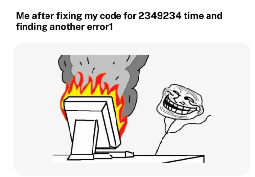

# 🕵️‍♀️ Fraud Detection with PySpark – Local Dev Prototype on Ubuntu (WSL2)

👉 [View the full code on GitHub](https://github.com/gabmansur/fraud-detection-pyspark-pipeline)


This is a clean and testable fraud detection prototype, built locally using PySpark and Ubuntu (via WSL2). It simulates how financial institutions could monitor transactions for suspicious activity while showing off a scalable, modular, and developer-friendly pipeline.

## Table of Contents

- [Overview](#overview)
- [Why This Project](#why-this-project)
- [Architecture](#architecture)
- [Pipeline Flow](#pipeline-flow)
- [Key Features](#key-features)
- [Setup and Usage](#setup-and-usage)
- [Fraud Detection Rules](#fraud-detection-rules)
- [Tests](#tests)
- [Output](#output)
- [Future Improvements](#future-improvements)
- [FAQ](#faq)

## Overview

This pipeline ingests transaction data, applies transformations, and flags potential fraudulent behavior based on frequency-based rules. It ends with visualizations that help explore anomalies in transaction patterns over time and volume.

Built as a hands-on prototype to demonstrate:

- Data engineering with PySpark
- Testing and transformation logic
- Visualization of suspicious behaviors
- Modular structure for future expansion

## Why This Project

Designed to simulate responsibilities in a real financial data engineering role, especially for domains like:

- Fraud detection
- Anti-money laundering (AML)
- Transaction monitoring
- Real-time alerting systems

The goal was to build something functional, readable, and portable—without relying on large infrastructure or cloud components.

## Architecture


<details>
<summary> 📁 Project Structure (click to expand)</summary>

```text
fraud-detection-pyspark-pipeline/
│
├── .github/workflows/
│   └── test.yml
├── artifacts/
│   ├── output.csv
│   ├── transaction_distribution.png
│   └── transactions_over_time.png
├── data/
│   └── transactions_demo.csv
├── notebooks/
│   └── final_report.ipynb
├── output/suspicious_transfers/
│   └── part-*.parquet
├── scripts/
│   ├── fraud_detection.py
│   ├── generate_fake_data.py
│   └── generate_report_notebook.py
├── src/
│   ├── etl.py
│   ├── fraud_rules.py
│   └── visualize.py
├── tests/
│   ├── test_etl.py
│   └── test_fraud_rules.py
├── Makefile
├── README.md
└── requirements.txt
```
</details>


## Pipeline Flow

The local data pipeline follows this flow:

1. **Load Raw Data**  
   CSV file from `data/transactions.csv` is read into a PySpark DataFrame. The structure of the transaction data is inspired in the public format described in the [Rabobank Developer Portal](https://developer.rabobank.nl/api-documentation). Columns like user_id, timestamp, amount, and counterparty_iban were adapted to reflect how real transaction records are formatted in banking APIs — keeping this as close to production as possible while still being lightweight and local.

2. **ETL Transformations**  
   Performed in [`etl.py`](src/etl.py), including:
   - Timestamp parsing
   - Missing value handling
   - Column normalization
   - Saving to `.csv` and `.parquet`

3. **Fraud Detection**  
   [`fraud_rules.py`](src/fraud_rules.py) applies multiple fraud-detection rules, returning filtered suspicious entries.

4. **Visualization**  
   [`visualize.py`](src/visualize.py) creates plots from the transformed data and saves them to `artifacts/`.

5. **Optional HTML Report**  
   Via Jupyter Notebook in `notebooks/final_report.ipynb`, executed using `make report`.


## Key Features

- **Modular Design**: Each step is isolated (ETL, rules, visualization)
- **Multiple Fraud Rules**: Combines time-based, value-based, and frequency-based filters
- **Seaborn Visualizations**: Clean and informative plots
- **Unit Tested**: Includes tests with `Pytest` to ensure pipeline reliability
- **Makefile Shortcuts**: Clean dev flow using `make run`, `make visualize`, etc.
- **Environment Portability**: Works inside WSL2 using `.venv`


## Setup and Usage

### Prerequisites

- Python 3.10+
- Java 8+ (required by PySpark)
- WSL2 or Ubuntu (recommended for consistent environment)

1. Clone and Initialize
```bash

git clone https://github.com/your-username/fraud-detection-pyspark-pipeline.git
cd fraud-detection-pyspark-pipeline
python3 -m venv .venv
source .venv/bin/activate  # WSL/Linux
```

2. Install Dependencies
```bash
pip install -r requirements.txt
```

3. Run the Pipeline

Here are the main `make` commands available:

| Command        | Description                                                                 |
|----------------|-----------------------------------------------------------------------------|
| `make help`    | List all available make commands with descriptions                          |
| `make init`    | Create virtual environment & install dependencies                           |
| `make fake`    | Generate fake transaction data (`scripts/generate_fake_data.py`)            |
| `make transform` | Run ETL pipeline (`src/etl.py`)                                            |
| `make fraud`   | Apply fraud detection rules (`scripts/fraud_detection.py`)                  |
| `make visualize` | Generate transaction distribution plots (`src/visualize.py`)              |
| `make report`  | Generate final HTML report from notebook (`notebooks/final_report.ipynb`)   |
| `make notebook`| (Optional) Generate notebook dynamically                                     |
| `make test`    | Run unit tests with Pytest                                                   |
| `make freeze`  | Freeze current environment into `requirements.txt` using pipreqs            |
| `make clean`   | Remove all artifacts, outputs, and caches                                    |
| `make prepare` | Create necessary folders for outputs and artifacts                          |
| `make run`     | Run full pipeline (prepare + init + fake + transform + fraud + visualize)   |
| `make all`     | Clean, run full pipeline, run tests, and generate report                    |

👉 You can run `make help` at any time to see all available commands with brief descriptions.

## Fraud Detection Rules

The pipeline includes four initial fraud detection rules, all defined in [`src/fraud_rules.py`](src/fraud_rules.py). Each rule is modular and easy to extend or modify.

| Rule Name             | Description                                                                 |
|-----------------------|-----------------------------------------------------------------------------|
| `high_value`          | Flags any transaction with an amount greater than €10,000                   |
| `weekend_transaction`| Flags transactions occurring on Saturday or Sunday                          |
| `rapid_repeated`      | Detects ≥3 transfers to the same IBAN within a 5-minute sliding window      |
| `unusual_time`        | Flags transactions made between 00:00 and 06:00                             |

> Each rule returns a filtered DataFrame containing only the suspicious entries matching that rule. These are then combined and deduplicated for final analysis and visualization.

You can easily add new rules by defining a new function in `fraud_rules.py` that:
1. Accepts a `DataFrame` as input
2. Applies a filtering condition
3. Returns a suspicious subset of transactions

### Sample Input

These are raw transactions from data/transactions.csv (based on Rabobank's API field structure):

| user\_id | timestamp           | amount | counterparty\_iban |
| -------- | ------------------- | ------ | ------------------ |
| u1       | 2023-01-01 12:00:00 | 100.00 | NL01BANK0123456789 |
| u1       | 2023-01-01 12:01:00 | 100.00 | NL01BANK0123456789 |
| u1       | 2023-01-01 12:02:00 | 100.00 | NL01BANK0123456789 |
| u2       | 2023-01-01 13:00:00 | 500.00 | NL02BANK9876543210 |


This input simulates real-time bank transfers. The pipeline detects that u1 made 3 transfers to the same IBAN in under 5 minutes — a red flag for fraud.

### Example Output (Flagged as Fraud)
After running the fraud detection logic, here’s what your pipeline catches:

| window\_start       | window\_end         | user\_id | counterparty\_iban | transfer\_count |
| ------------------- | ------------------- | -------- | ------------------ | --------------- |
| 2023-01-01 12:00:00 | 2023-01-01 12:05:00 | u1       | NL01BANK0123456789 | 3               |


 Explanation:
This row shows a 5-minute window where u1 made 3 transfers to the same IBAN — a pattern that often signals automated or malicious activity (like account takeover or fraud ring behavior). Perfect use-case for banks like Rabobank 


## Tests


All unit tests are located in the [`tests/`](tests/) folder and follow the `pytest` framework.

```bash
make test
```

| File                        | What it Tests                                 |
|-----------------------------|-----------------------------------------------|
| `tests/test_etl.py`         | ETL pipeline logic, data types, null handling |
| `tests/test_fraud_rules.py` | All individual fraud detection rules          |
| `tests/conftest.py`         | Shared fixtures and mock data                 |

## Coverage

- Ensures ETL produces valid, clean DataFrames  
- Verifies fraud rules return expected suspicious transactions  
- Tests run fast and are isolated for local development  
- Works with GitHub Actions CI (`.github/workflows/test.yml`)


## Output

Artifacts are automatically saved to the `artifacts/` directory upon pipeline execution.

| File                                     | Description                                  |
|------------------------------------------|----------------------------------------------|
| `artifacts/output.csv`                   | Cleaned + transformed transactions (CSV)     |
| `artifacts/output.parquet`               | Same data in Parquet format (for big data)   |
| `artifacts/transaction_distribution.png` | Histogram of transaction amounts (Seaborn)   |
| `artifacts/final_report.html`            | Rendered Jupyter notebook report (optional)  |

To regenerate the output files manually:

```bash
make visualize
make report
```

## Future Improvements

This project can be extended in multiple directions to increase robustness, scalability, and coverage:

- **Additional Fraud Rules**  
  Implement more sophisticated rules (e.g., sudden location changes, round-amount transfers, account velocity) using a rules engine or ML model.

- **Real-time Streaming Support**  
  Migrate from batch processing to real-time detection using Spark Structured Streaming and Kafka/EventHub.

- **Dashboards & Alerts**  
  Integrate live dashboards (e.g., Power BI, Grafana) and real-time fraud alerts via email, Slack, or webhook.

- **Enhanced Test Coverage**  
  Expand test coverage with property-based testing, data fuzzing, and integration tests.

- **CI/CD Enhancements**  
  Add automated linting, coverage reporting, and Docker-based deployment for production readiness.

- **Data Versioning**  
  Integrate with tools like DVC or Delta Lake to track data lineage and model versions.

- **Anomaly Detection with Machine Learning**  
  Introduce unsupervised ML techniques to detect novel fraud patterns beyond rule-based logic.

- **Support for Multiple Input Sources**  
  Generalize the pipeline to support additional data formats (e.g., JSON, Parquet) and APIs.

- **User Behavior Modeling**  
  Build user-level profiling to detect behavior deviation over time.


## FAQ

❓ Why did you build this project?

To demonstrate how to
- Design and execute a modular, testable, end-to-end PySpark pipeline
- Translate business needs (fraud detection, compliance) into scalable logic
- Showcase technical breadth and strategic thinking — from data transformation to stakeholder-ready visualizations
- Also, to prove that you don’t need a 100-man team and five microservices to make something robust and useful.

❓ Why fraud detection?

Because it matters. Whether it’s compliance, transaction monitoring, or anti-money laundering, fraud detection is a clear, high-impact example of how data pipelines serve real-world risk mitigation. Also? It’s fun to model patterns that seem almost human in their sneakiness, lol

❓ Why PySpark?

It’s used in production environments by banks, fintechs, and data platforms I’d love to work with. It scales, it’s testable, and you can build elegant workflows with it. Real pipelines aren’t pandas-only and I wanted to show comfort in distributed contexts.

❓Why not go bigger?

The goal wasn’t “build the next Palantir.” It was to:
- Focus on quality over quantity
- Keep it clean and local, no unnecessary cloud complexity for a prototype
- Keep the cognitive load low for reviewers (you)

❓ Why the notebook report and Seaborn plots?

Because technical stakeholders need validation, and business stakeholders want to see something. The final_report.html and the distribution chart serve both ends of the spectrum. Also, visual context is crucial when interpreting thresholds or rule sensitivity.

❓Why Makefile + venv + WSL2?
I wanted a workflow that:

- Runs the same way every time — no surprises
- Doesn’t require an IDE or heavy config
- Shows environment maturity and cross-platform portability
- Also: fewer buttons, more predictability.

❓What’s the business value?

- For banks like Rabobank:
   - These pipelines form the backbone of regulatory compliance systems
   - Rules like these contribute to real-time fraud alerts and monitoring workflows
   - The project simulates a simplified but extendable version of what could plug into transaction surveillance tooling
- For teams:
   - Demonstrates the crossover of an engineer and a strategist
   - Clear documentation and modular design mean it can scale, be explained, and be owned

❓Why didn’t you use machine learning?

Because not every problem requires an XGBoost model to prove technical competence, hehe. Most fraud detection in production still relies on heuristic and rules-based systems especially for explainability, auditability, and integration with legacy systems. This prototype follows that philosophy: use what works, build confidence first, then layer on the complexity if and when it's needed.

❓How would you productionize this?
In phases:
1. Infrastructure: Containerize the jobs, deploy on Airflow or Databricks for orchestration.
2. Monitoring: Add logging to a central system (e.g., ELK or Azure Monitor), plus basic rule alerting.
3. Integration: Wrap fraud rules into a REST API or push to a message bus for real-time streaming ingestion.
4. Governance: Schema evolution, version control for rules, and alerts for drift or logic fatigue.
5. Scaling: Move from local to cluster-ready Spark jobs (easy thanks to PySpark's portability).

❓Why is there a Makefile in a Spark project?

Because I believe the command line should feel like a conversation, not a battle.
Also, I have better things to do than remember 6 flags every time I want to test something. Like giving Tom and Mia attention and drinking 5 cups of coffee per day

❓What surprised you while building this?

Honestly, I spent more time debugging Windows issues than writing code... Between weird python3 alias issues, pip behaving like it was on vacation, and file paths deciding to rebel, I quickly learned that trying to do data engineering on native Windows is like trying to run a marathon in flip-flops.



Switching to Ubuntu via WSL2 felt like moving from dial-up to fiber. Suddenly dependencies just worked, PySpark behaved and Makefile commands actually ran without cryptic errors

Moral of the story: I spent more time learning what not to do in cross-platform setups than expected, but that’s part of the journey. Now I know how to build stuff that actually runs cleanly on any machine. Including one with a cat sitting on the keyboard.

❓ Where do Tom and Mia fit into this pipeline?

Tom is Head of QA: he walks across the keyboard during testing.
Mia is the quiet CTO: she watches from her bench and judges your DAG decisions in silence.
Coffee is the uncredited co-author of every function that works on the first try.

📫 Reach out on [LinkedIn](https://linkedin.com/in/gabriellamansur) or [email](mailto:gabmansur@gmail.com) if you’d like to chat about the project or see how I approach real-world engineering challenges.